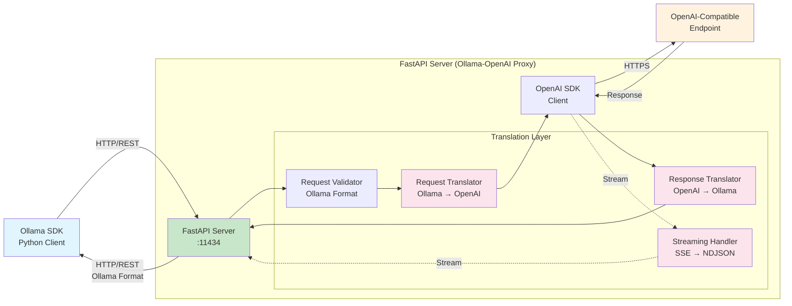
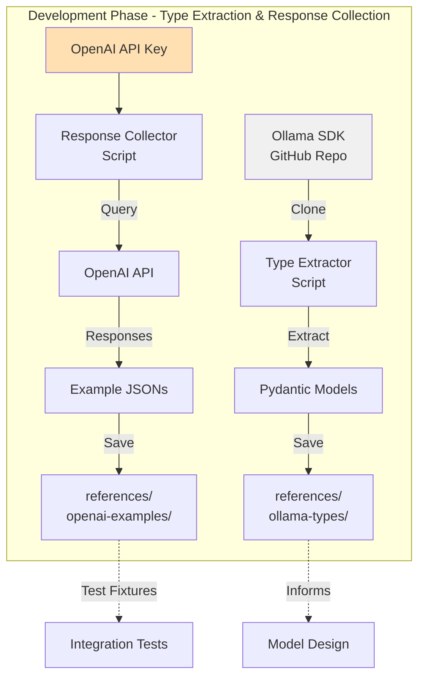
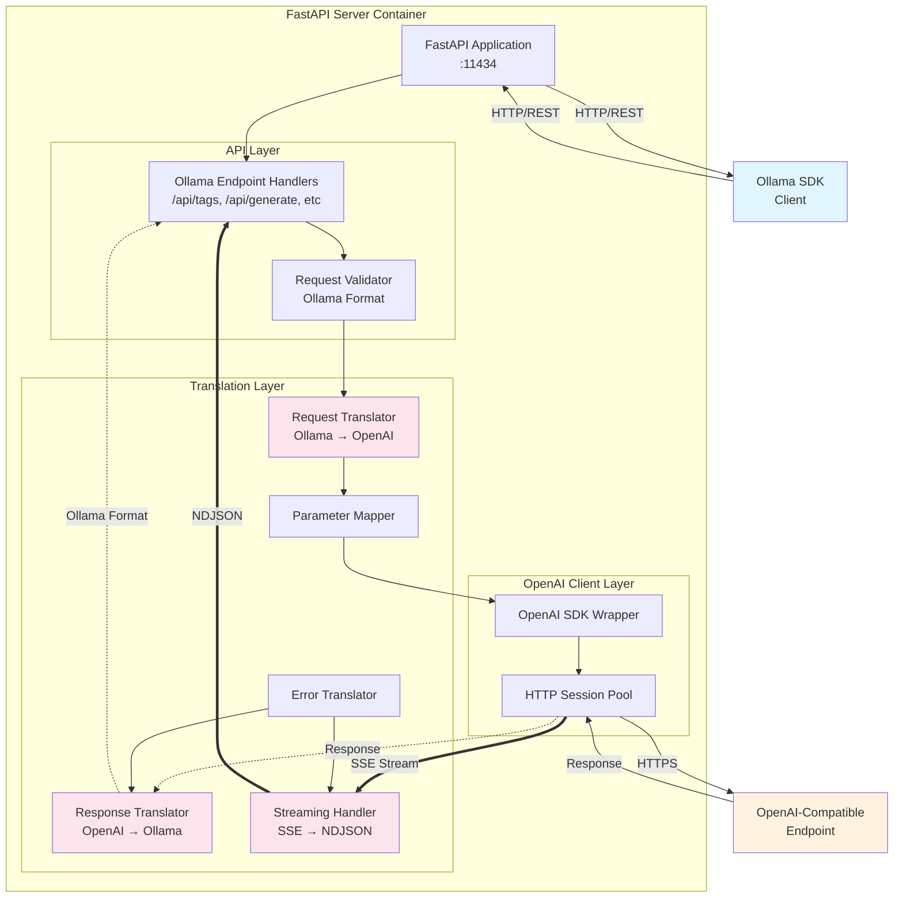
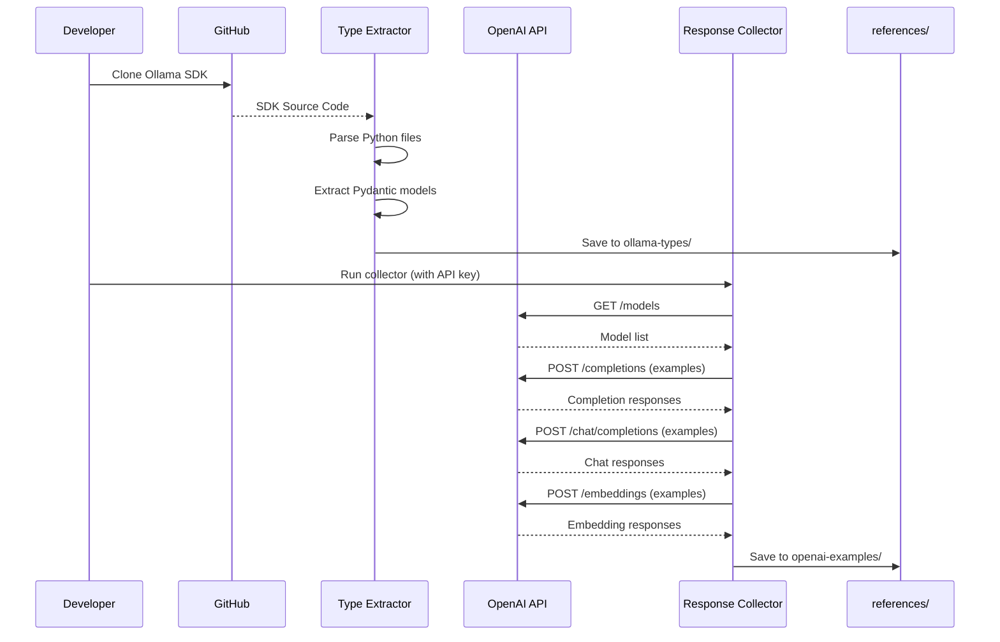
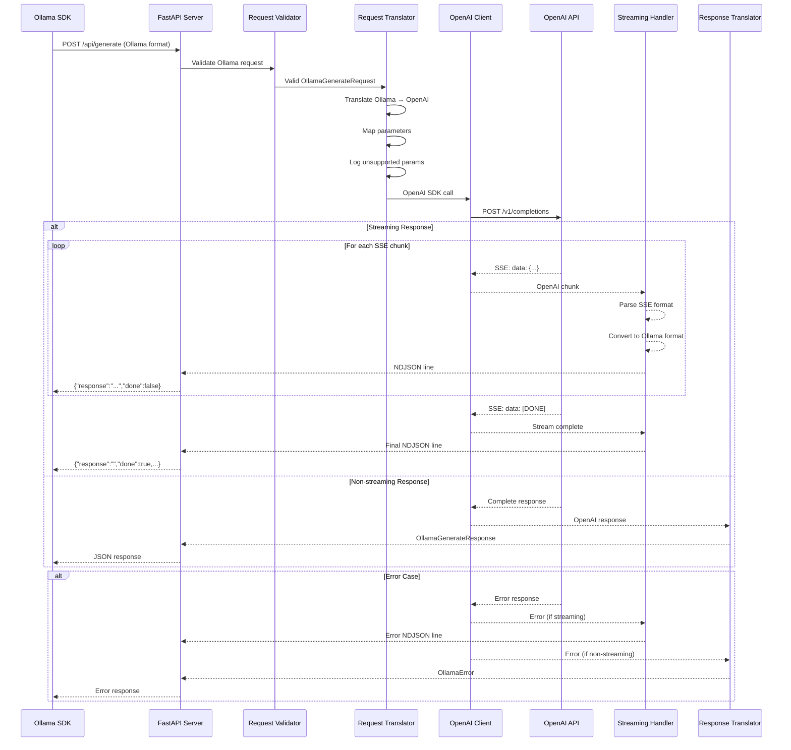
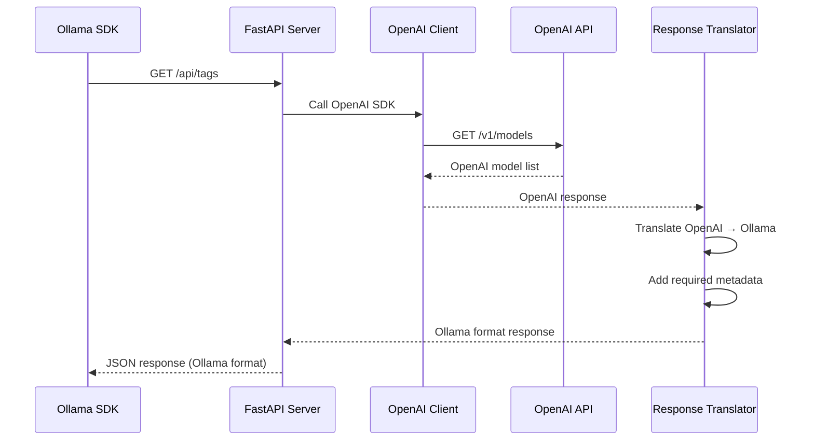

# Ollama-OpenAI Proxy Architecture Document

## Introduction

This document outlines the overall project architecture for Ollama-OpenAI Proxy, including backend systems, shared services, and non-UI specific concerns. Its primary goal is to serve as the guiding architectural blueprint for AI-driven development, ensuring consistency and adherence to chosen patterns and technologies.

**Relationship to Frontend Architecture:**
If the project includes a significant user interface, a separate Frontend Architecture Document will detail the frontend-specific design and MUST be used in conjunction with this document. Core technology stack choices documented herein (see "Tech Stack") are definitive for the entire project, including any frontend components.

### Starter Template or Existing Project

N/A - This project is being built from scratch without using any starter template.

### Change Log

| Date | Version | Description | Author |
|------|---------|-------------|--------|
| 2025-07-26 | 1.0 | Initial architecture document | AI Architect |
| 2025-07-26 | 2.0 | Converted to template format with Phase 1 focus | Winston (AI Architect) |
| 2025-07-29 | 3.0 | Refactored to SDK-based approach with TDD methodology | Claude (AI Architect) |

## High Level Architecture

### Technical Summary

The Ollama-OpenAI Proxy is a FastAPI server that acts as a translation layer between Ollama SDK clients and OpenAI-compatible endpoints. When an Ollama SDK makes HTTP/REST requests, the FastAPI server receives them in Ollama format, translates them to OpenAI format using the OpenAI SDK, forwards them to OpenAI-compatible endpoints, and then translates the responses back to Ollama format. The implementation follows a Test-Driven Development (TDD) approach, using Pydantic models extracted from the official Ollama SDK source code as the foundation for type safety and compatibility. The system uses Python 3.12 with async processing for efficient streaming support, containerized with Docker for easy deployment. Phase 1 requires an OpenAI API key to collect real response examples that serve as test fixtures, ensuring accurate translation between the two APIs. Core architectural patterns include SDK-based model extraction, real response collection, and strict type validation using Pydantic v2, all guided by KISS (Keep It Simple, Stupid) and YAGNI (You Aren't Gonna Need It) principles.

### High Level Overview

1. **Architectural Style**: Simple HTTP Proxy / API Gateway pattern
2. **Repository Structure**: Single repository (not applicable for monorepo/polyrepo as it's a single service)
3. **Service Architecture**: Monolithic proxy service with clear internal component separation
4. **Primary Data Flow**: 
   - Ollama SDK (HTTP/REST) → FastAPI Server → Translation Layer (Ollama→OpenAI) → OpenAI SDK → OpenAI-Compatible Endpoint
   - Response flow: OpenAI Endpoint → OpenAI SDK → Translation Layer (OpenAI→Ollama) → FastAPI Server → Ollama SDK
5. **Key Architectural Decisions**:
   - **SDK-Based Types**: Extract and use Ollama SDK's Pydantic models as source of truth
   - **TDD Methodology**: Write tests using Ollama SDK client before implementation
   - **Real Response Collection**: Capture actual OpenAI responses for accurate test fixtures
   - **Transparency First**: Act as invisible middleware between Ollama SDK and OpenAI
   - **Stateless Design**: No session management or request history
   - **Streaming Support**: Native async streaming for real-time responses
   - **Type Safety**: Pydantic v2 models for all request/response validation

### High Level Project Diagram



### Development Phase Diagram



### Architectural and Design Patterns

- **SDK Type Extraction Pattern:** Extract Pydantic models directly from Ollama SDK source - *Rationale:* Ensures 100% compatibility with SDK expectations
- **Test-Driven Development Pattern:** Write tests using Ollama SDK before implementation - *Rationale:* Guarantees compatibility and reduces rework
- **Response Collection Pattern:** Capture real OpenAI responses as test fixtures - *Rationale:* Ensures accurate translation based on actual API behavior
- **API Gateway Pattern:** Single entry point for all Ollama requests with protocol translation - *Rationale:* Provides clean interface and centralized request handling
- **Adapter Pattern:** Translation layer converts between Ollama and OpenAI formats - *Rationale:* Decouples format differences and enables independent evolution
- **Repository Pattern:** Abstraction for OpenAI client interactions - *Rationale:* Enables testing with mocks and potential future provider switching
- **Streaming Pattern:** Newline-delimited JSON (NDJSON) for real-time response streaming - *Rationale:* Matches Ollama SDK expectations for streaming responses
- **Error Mapping Pattern:** Standardized error translation between APIs - *Rationale:* Maintains compatibility with Ollama SDK error handling

## Tech Stack

**CRITICAL**: This table represents the DEFINITIVE technology choices for the project. All implementation MUST use these exact versions and technologies.

### Cloud Infrastructure

- **Provider:** On-premises / Self-hosted
- **Key Services:** Docker host, GitHub (for CI/CD)
- **Deployment Regions:** N/A (on-premises)

### Technology Stack Table

| Category | Technology | Version | Purpose | Rationale |
|----------|------------|---------|---------|-----------|
| **Language** | Python | 3.12 | Primary development language | Required by dev environment spec, modern async support |
| **Runtime** | Python | 3.12 | Application runtime | Native async/await, performance improvements |
| **Framework** | FastAPI | 0.109.0 | Web framework | Native async, automatic OpenAPI docs, Pydantic integration |
| **ASGI Server** | Uvicorn | 0.27.0 | ASGI server | FastAPI recommended, production-ready, good performance |
| **Ollama SDK** | ollama | latest | Ollama client library | Source for type extraction, test client |
| **HTTP Client** | OpenAI SDK | 1.12.0 | OpenAI API client | Official SDK, streaming support, type safety |
| **HTTP Client** | HTTPX | 0.26.0 | Async HTTP client | Required by OpenAI SDK, modern async support |
| **Validation** | Pydantic | 2.5.3 | Data validation | v2 features required, FastAPI integration, type safety |
| **JSON Processing** | orjson | 3.9.12 | Fast JSON parsing | 3x faster than standard json, recommended for performance |
| **Logging** | structlog | 24.1.0 | Structured logging | JSON output, context preservation, FastAPI integration |
| **Testing** | pytest | 7.4.4 | Test framework | Industry standard, async support, good fixture system |
| **Testing** | pytest-asyncio | 0.23.3 | Async test support | Required for testing async FastAPI endpoints |
| **Testing** | pytest-cov | 4.1.0 | Coverage reporting | Track test coverage, ensure quality |
| **Code Quality** | black | 23.12.1 | Code formatter | Consistent formatting, no debates |
| **Code Quality** | flake8 | 7.0.0 | Linter | Catch common errors, enforce style |
| **Code Quality** | mypy | 1.8.0 | Type checker | Catch type errors, improve code quality |
| **Container** | Docker | 24.0 | Containerization | Standard deployment, isolation, reproducibility |
| **Orchestration** | Docker Compose | 3.8 | Local orchestration | Simple multi-container management for development |
| **VCS** | Git | latest | Version control | Industry standard |
| **CI/CD** | GitHub Actions | N/A | CI/CD platform | Integrated with repository, free for public repos |
| **API Docs** | Swagger/ReDoc | Built-in | API documentation | Automatic from FastAPI, no additional setup |

**Please confirm these technology choices before proceeding. Are there any versions you'd like to adjust or additional tools to include?**

## Data Models

### Request/Response Models

**Purpose:** Validate and structure API requests/responses between Ollama SDK and the proxy

**Key Attributes:**
- All models extracted from Ollama SDK source code (GitHub)
- Stored as reference in `references/ollama-types/`
- Enhanced with Pydantic v2 features for our implementation
- Strict validation ensuring Ollama SDK compatibility
- Real OpenAI responses stored in `references/openai-examples/`

**Relationships:**
- OllamaRequest models → RequestTranslator → OpenAIRequest models
- OpenAIResponse models → ResponseTranslator → OllamaResponse models

### Model Mapping

**Purpose:** Define parameter and field mappings between Ollama and OpenAI APIs

**Key Attributes:**
- parameter_map: Dict[str, str] - Direct parameter mappings
- unsupported_params: List[str] - Parameters to log warnings for
- value_transformers: Dict[str, Callable] - Functions to transform parameter values

**Relationships:**
- Used by RequestTranslator and ResponseTranslator
- References both Ollama and OpenAI model definitions

## Components

### SDK Type Extractor

**Responsibility:** Extract Pydantic models from Ollama SDK source code

**Key Interfaces:**
- `extract_models_from_sdk(sdk_path: str) -> Dict[str, str]`
- `save_raw_models(models: Dict[str, str], output_dir: str)`
- `analyze_model_fields(model_class: Type) -> Dict[str, Any]`

**Dependencies:** GitHub clone of Ollama SDK, Python AST parser

**Technology Stack:** Python 3.12, ast module, GitPython

**Notes:** Runs only during development phase, not part of runtime

### OpenAI Response Collector

**Responsibility:** Collect real OpenAI API responses for test fixtures

**Key Interfaces:**
- `collect_model_list() -> Dict[str, Any]`
- `collect_completion_examples(prompts: List[str]) -> List[Dict]`
- `collect_chat_examples(conversations: List[List[Dict]]) -> List[Dict]`
- `collect_embedding_examples(texts: List[str]) -> List[Dict]`
- `save_responses(responses: Dict[str, Any], output_dir: str)`

**Dependencies:** OpenAI SDK, Valid API key (required)

**Technology Stack:** OpenAI SDK 1.12.0, Python 3.12

**Notes:** Requires OPENAI_API_KEY environment variable

### FastAPI Server

**Responsibility:** HTTP server handling Ollama API endpoints and request routing

**Key Interfaces:**
- `GET /api/tags` - List available models
- `POST /api/generate` - Text generation (completion)
- `POST /api/chat` - Chat completion
- `POST /api/embeddings` - Generate embeddings
- `GET /health` - Health check endpoint
- `GET /docs` - Swagger UI documentation
- `GET /redoc` - ReDoc documentation

**Dependencies:** Request Validator, Request/Response Translators, OpenAI Client Wrapper

**Technology Stack:** FastAPI 0.109.0, Uvicorn 0.27.0, Python 3.12

### Request Validator

**Responsibility:** Validate incoming Ollama requests using Pydantic models

**Key Interfaces:**
- `validate_generate_request(data: dict) -> OllamaGenerateRequest`
- `validate_chat_request(data: dict) -> OllamaChatRequest`
- `validate_embeddings_request(data: dict) -> OllamaEmbeddingsRequest`

**Dependencies:** Pydantic models based on extracted Ollama SDK types

**Technology Stack:** Pydantic 2.5.3

### Translation Layer

**Responsibility:** Convert between Ollama and OpenAI request/response formats

**Key Interfaces:**
- `translate_generate_request(ollama_req) -> OpenAICompletionRequest`
- `translate_chat_request(ollama_req) -> OpenAIChatRequest`
- `translate_embedding_request(ollama_req) -> OpenAIEmbeddingRequest`
- `translate_completion_response(openai_resp) -> OllamaGenerateResponse`
- `translate_chat_response(openai_resp) -> OllamaChatResponse`
- `translate_models_list(openai_models) -> OllamaTagsResponse`

**Dependencies:** Model Mapping configuration, Logging for unsupported parameters

**Technology Stack:** Pure Python with structlog for warning logs

### OpenAI Client Wrapper

**Responsibility:** Manage OpenAI API interactions with proper error handling

**Key Interfaces:**
- `list_models() -> List[Model]`
- `create_completion(**kwargs) -> CompletionResponse`
- `create_chat_completion(**kwargs) -> ChatResponse`
- `create_embedding(**kwargs) -> EmbeddingResponse`

**Dependencies:** OpenAI Python SDK, environment configuration

**Technology Stack:** OpenAI SDK 1.12.0, HTTPX 0.26.0

### Streaming Handler

**Responsibility:** Convert OpenAI SSE streaming format to Ollama's newline-delimited JSON format in real-time

**Key Interfaces:**
- `stream_generate_response(openai_stream) -> AsyncGenerator[str]`
- `stream_chat_response(openai_stream) -> AsyncGenerator[str]`
- `parse_sse_chunk(sse_data: str) -> dict` - Extract JSON from SSE format
- `format_ollama_chunk(openai_chunk: dict, done: bool) -> str` - Convert to NDJSON line
- `handle_stream_error(error: Exception) -> str` - Format streaming errors

**Dependencies:** JSON processing (orjson), Direct format conversion (no Response Translator)

**Technology Stack:** Python async generators, orjson 3.9.12, SSE parsing

**Streaming Format Details:**
- **Input:** OpenAI SSE format: `data: {"choices":[{"delta":{"content":"text"}}]}`
- **Output:** Ollama NDJSON format: `{"model":"...","response":"text","done":false}`
- **Completion Signal:** OpenAI sends `data: [DONE]`, convert to `{"done":true,...}`
- **Content Type:** Return `application/x-ndjson` with proper streaming headers

### Error Handler

**Responsibility:** Translate OpenAI errors to Ollama-compatible error format

**Key Interfaces:**
- `translate_openai_error(openai_error: OpenAIError) -> OllamaError`
- `get_error_status_code(error_type: str) -> int`

**Dependencies:** Error mapping configuration

**Technology Stack:** Pure Python exception handling

## Component Diagrams



## External APIs

### OpenAI API

- **Purpose:** Provides the actual AI model capabilities (completions, chat, embeddings)
- **Documentation:** https://platform.openai.com/docs/api-reference
- **Base URL(s):** https://api.openai.com/v1 (configurable via OPENAI_API_BASE_URL)
- **Authentication:** Bearer token using API key from environment variable
- **Rate Limits:** Depends on OpenAI account tier (not enforced by proxy in Phase 1)

**Key Endpoints Used:**
- `GET /models` - List available models
- `POST /completions` - Text generation
- `POST /chat/completions` - Chat-based generation
- `POST /embeddings` - Generate embeddings

**Integration Notes:** All requests include proper error handling with automatic retry (up to 3 attempts). Streaming responses use Server-Sent Events. API key must be valid or all requests will fail with 401.

## Core Workflows

### Development Phase Workflow



### Generate Text Workflow



### List Models Workflow



## REST API Spec

```yaml
openapi: 3.0.0
info:
  title: Ollama-OpenAI Proxy API
  version: 1.0.0
  description: Transparent proxy translating Ollama API calls to OpenAI
servers:
  - url: http://localhost:11434
    description: Default Ollama port

paths:
  /api/tags:
    get:
      summary: List available models
      responses:
        200:
          description: List of models in Ollama format
          content:
            application/json:
              schema:
                $ref: '#/components/schemas/TagsResponse'

  /api/generate:
    post:
      summary: Generate text completion
      requestBody:
        required: true
        content:
          application/json:
            schema:
              $ref: '#/components/schemas/GenerateRequest'
      responses:
        200:
          description: Generated text
          content:
            application/json:
              schema:
                $ref: '#/components/schemas/GenerateResponse'
              description: Non-streaming response
            application/x-ndjson:
              schema:
                type: string
                description: Newline-delimited JSON streaming response
              example: |
                {"model":"llama3.1","created_at":"2024-01-01T00:00:00Z","response":"The","done":false}
                {"model":"llama3.1","created_at":"2024-01-01T00:00:01Z","response":" sky","done":false}
                {"model":"llama3.1","created_at":"2024-01-01T00:00:02Z","response":" is","done":true,"context":[...],"total_duration":1000000000}

  /api/chat:
    post:
      summary: Chat completion
      requestBody:
        required: true
        content:
          application/json:
            schema:
              $ref: '#/components/schemas/ChatRequest'
      responses:
        200:
          description: Chat response
          content:
            application/json:
              schema:
                $ref: '#/components/schemas/ChatResponse'
              description: Non-streaming response
            application/x-ndjson:
              schema:
                type: string
                description: Newline-delimited JSON streaming response
              example: |
                {"model":"llama3.1","created_at":"2024-01-01T00:00:00Z","message":{"role":"assistant","content":"Hello"},"done":false}
                {"model":"llama3.1","created_at":"2024-01-01T00:00:01Z","message":{"role":"assistant","content":" there"},"done":false}
                {"model":"llama3.1","created_at":"2024-01-01T00:00:02Z","message":{"role":"assistant","content":"!"},"done":true,"total_duration":1000000000}

  /api/embeddings:
    post:
      summary: Generate embeddings
      requestBody:
        required: true
        content:
          application/json:
            schema:
              $ref: '#/components/schemas/EmbeddingsRequest'
      responses:
        200:
          description: Embeddings response
          content:
            application/json:
              schema:
                $ref: '#/components/schemas/EmbeddingsResponse'

  /health:
    get:
      summary: Health check
      responses:
        200:
          description: Service is healthy
          content:
            application/json:
              schema:
                type: object
                properties:
                  status:
                    type: string
                    enum: [healthy]

components:
  schemas:
    # Note: Full schemas to be generated from Postman collection
    GenerateRequest:
      type: object
      required: [model, prompt]
      properties:
        model:
          type: string
        prompt:
          type: string
        stream:
          type: boolean
          default: false
        options:
          type: object
```

## Database Schema

N/A - This service is stateless and does not require any database. All data is transient, passing through the proxy without persistence.

## Source Tree

```plaintext
ollama-openai-proxy/
├── app/
│   ├── __init__.py
│   ├── main.py                    # FastAPI app entry point
│   ├── config.py                  # Environment configuration
│   ├── models/
│   │   ├── __init__.py
│   │   ├── ollama/               # Ollama API models (SDK-based)
│   │   │   ├── __init__.py
│   │   │   ├── generate.py
│   │   │   ├── chat.py
│   │   │   ├── embeddings.py
│   │   │   └── models.py
│   │   └── openai/               # OpenAI API models
│   │       ├── __init__.py
│   │       └── models.py
│   ├── translators/
│   │   ├── __init__.py
│   │   ├── request.py            # Request translation logic
│   │   ├── response.py           # Response translation logic
│   │   └── mappings.py           # Parameter mapping definitions
│   ├── handlers/
│   │   ├── __init__.py
│   │   ├── generate.py           # /api/generate endpoint
│   │   ├── chat.py               # /api/chat endpoint
│   │   ├── embeddings.py         # /api/embeddings endpoint
│   │   ├── tags.py               # /api/tags endpoint
│   │   └── health.py             # /health endpoint
│   ├── clients/
│   │   ├── __init__.py
│   │   └── openai_client.py      # OpenAI SDK wrapper
│   └── utils/
│       ├── __init__.py
│       ├── streaming.py          # Streaming utilities
│       ├── errors.py             # Error handling
│       └── logging.py            # Logging configuration
├── tests/
│   ├── __init__.py
│   ├── conftest.py               # Pytest configuration
│   ├── integration/              # Ollama SDK tests
│   │   ├── __init__.py
│   │   ├── test_tags_integration.py
│   │   ├── test_generate_integration.py
│   │   ├── test_chat_integration.py
│   │   └── test_embeddings_integration.py
│   └── unit/                     # Component tests
│       ├── __init__.py
│       ├── test_request_translator.py
│       ├── test_response_translator.py
│       ├── test_parameter_mapping.py
│       ├── test_error_handling.py
│       └── test_streaming_handler.py
├── scripts/
│   ├── setup_dev.sh              # Development environment setup
│   ├── extract_sdk_types.py      # Extract types from Ollama SDK
│   ├── collect_openai_responses.py # Collect OpenAI responses
│   ├── run_tests.sh              # Run all tests
│   └── run_local.sh              # Run proxy locally
├── references/                   # Reference data (not in production)
│   ├── ollama-types/            # Raw extracted Ollama SDK models
│   │   ├── __init__.py
│   │   ├── generate.py
│   │   ├── chat.py
│   │   ├── embeddings.py
│   │   └── models.py
│   └── openai-examples/         # Collected OpenAI responses
│       ├── models.json
│       ├── completions/
│       │   └── example_*.json
│       ├── chat/
│       │   └── example_*.json
│       └── embeddings/
│           └── example_*.json
├── docker/
│   ├── Dockerfile
│   └── docker-compose.yml
├── docs/
│   ├── architecture.md           # This document
│   ├── architecture_learnings.md # Learnings from implementation
│   └── prd.md                   # Product Requirements Document
├── .env.example                  # Example configuration
├── requirements.txt              # Production dependencies
├── requirements-dev.txt          # Development dependencies
├── pytest.ini                    # Pytest configuration
├── .gitignore
└── README.md                     # Project overview
```

## Infrastructure and Deployment

### Development Environment

- **Primary Environment:** VSCode DevContainer (pre-configured with Python 3.12)
- **Working Directory:** `/workspace` (all files mounted here for easy navigation)
- **DevContainer Status:** Already set up and ready to use - no build tasks required
- **Benefits:**
  - No need for virtual environment (venv) management
  - Consistent environment between development and production
  - Claude Code can navigate easily without venv activation issues
  - All dependencies pre-installed in container
  - Python 3.12 runtime pre-configured
- **DevContainer Configuration:** `.devcontainer/devcontainer.json`

### Infrastructure as Code

- **Tool:** Docker 24.0
- **Location:** `docker/` (production), `.devcontainer/` (development)
- **Approach:** 
  - Development: VSCode DevContainer for isolated development
  - CI/CD: Docker containers in GitHub Actions
  - Production: Docker container deployment

### Deployment Strategy

- **Strategy:** Container-based deployment using Docker
- **CI/CD Platform:** GitHub Actions (running in Docker containers)
- **Pipeline Configuration:** `.github/workflows/`

### Environments

- **Development:** VSCode DevContainer - Isolated container environment at `/workspace`
- **CI/CD:** Docker containers in GitHub Actions - Ensures consistency
- **Staging:** Not required for Phase 1 POC
- **Production:** On-premises Docker host - Single container deployment

### Environment Promotion Flow

```text
Development (Local) -> Production (On-premises)
                      
Simple flow for POC:
1. Test locally with docker-compose
2. Build production image
3. Deploy to on-premises Docker host
```

### Rollback Strategy

- **Primary Method:** Docker image rollback (keep previous image version)
- **Trigger Conditions:** Failed health checks, critical errors in logs
- **Recovery Time Objective:** < 5 minutes (time to pull and start previous image)

## Error Handling Strategy

### General Approach

- **Error Model:** Exception-based with specific error types for each failure mode
- **Exception Hierarchy:** Base `ProxyError` with specific subclasses for translation, client, and validation errors
- **Error Propagation:** Catch at handler level, translate to appropriate HTTP response

### Logging Standards

- **Library:** structlog 24.1.0
- **Format:** JSON structured logs
- **Levels:** DEBUG, INFO, WARNING, ERROR, CRITICAL
- **Required Context:**
  - Correlation ID: UUID per request
  - Service Context: Component name, method name
  - User Context: No user tracking in Phase 1

### Error Handling Patterns

#### External API Errors

- **Retry Policy:** Built-in OpenAI SDK retry with max_retries=3
- **Circuit Breaker:** Not implemented in Phase 1 (YAGNI)
- **Timeout Configuration:** 600 seconds (configurable via REQUEST_TIMEOUT)
- **Error Translation:** Direct mapping of OpenAI errors to Ollama format

#### Streaming-Specific Error Handling

- **Mid-Stream Errors:** Convert to error NDJSON line with `"error"` field
- **Connection Drops:** Gracefully close stream with final `{"done":true,"error":"connection lost"}`
- **Format:** `{"error":"error message","done":true}` for streaming errors
- **Partial Response Handling:** Include any partial content before error occurs

#### Business Logic Errors

- **Custom Exceptions:** `ValidationError`, `TranslationError`, `UnsupportedParameterError`, `StreamingError`
- **User-Facing Errors:** JSON error response matching Ollama format
- **Error Codes:** Use HTTP status codes only

#### Data Consistency

- **Transaction Strategy:** N/A - stateless service
- **Compensation Logic:** N/A - no state to compensate
- **Idempotency:** All operations are naturally idempotent

## Coding Standards

### Core Standards

- **Languages & Runtimes:** Python 3.12 (exact version required)
- **Style & Linting:** black (23.12.1), flake8 (7.0.0), mypy (1.8.0)
- **Pre-commit Hooks:** Can be temporarily disabled during rapid development
  - Use `git commit --no-verify` when needed
  - Epic planned to ensure all hooks are working before final delivery
- **Test Organization:** `tests/unit/test_<component>.py`, `tests/integration/test_<endpoint>_integration.py`

### Naming Conventions

| Element | Convention | Example |
|---------|------------|---------|
| Files | snake_case | `request_translator.py` |
| Classes | PascalCase | `RequestTranslator` |
| Functions | snake_case | `translate_generate_request` |
| Constants | UPPER_SNAKE_CASE | `MAX_RETRIES` |
| Test files | test_<module> | `test_request_translator.py` |

### Critical Rules

- **DevContainer Usage:** All development happens inside the DevContainer at `/workspace`
- **No venv Management:** DevContainer eliminates need for virtual environment activation
- **No console.log:** Use structlog for all logging, never print statements
- **Use type hints:** All functions must have complete type annotations
- **Test coverage:** Minimum 80% coverage per component
- **No hardcoded values:** All configuration via environment variables
- **Pydantic for validation:** Never manually validate JSON, use Pydantic models
- **Async everywhere:** Use async/await for all I/O operations
- **No commented code:** Delete unused code, don't comment it out
- **Coding Standards Epic:** Final epic will verify all coding standards and pre-commit hooks

### Language-Specific Guidelines

#### Python Specifics

- **Import order:** Standard library, third-party, local (separated by blank lines)
- **Docstrings:** Use Google style docstrings for all public functions
- **Exception handling:** Always catch specific exceptions, never bare except
- **Context managers:** Use `async with` for all client operations

## Test Strategy and Standards

### Testing Philosophy

- **Approach:** Test-Driven Development (TDD) - Write tests first using Ollama SDK
- **Coverage Goals:** 80% minimum per component, 90% for critical paths
- **Test Pyramid:** 70% unit tests, 25% integration tests, 5% e2e tests
- **OpenAI API Key:** Required for integration tests and response collection

### Test Types and Organization

#### Unit Tests

- **Framework:** pytest 7.4.4
- **File Convention:** `test_<module_name>.py`
- **Location:** `tests/unit/`
- **Mocking Library:** pytest built-in fixtures and unittest.mock
- **Coverage Requirement:** 80% minimum

**AI Agent Requirements:**
- Generate tests for all public methods
- Cover edge cases and error conditions
- Follow AAA pattern (Arrange, Act, Assert)
- Mock all external dependencies

#### Integration Tests

- **Scope:** Test with actual Ollama SDK against running proxy
- **Location:** `tests/integration/`
- **Test Infrastructure:**
  - **OpenAI API:** Mock using collected responses from `references/openai-examples/`
  - **Ollama SDK:** Real SDK configured to hit localhost:11434
  - **FastAPI Server:** Running instance of our proxy
- **OpenAI API Key:** Required for collecting test fixtures

#### End-to-End Tests

- **Framework:** pytest with real services
- **Scope:** Full request/response flow with actual OpenAI API (Phase 2)
- **Environment:** Local Docker environment
- **Test Data:** Minimal prompts to reduce API costs

### Test Data Management

- **Strategy:** Real responses collected from OpenAI API
- **Fixtures:** `references/openai-examples/` containing actual API responses
- **SDK Types:** `references/ollama-types/` for validation
- **Factories:** Not needed for this simple proxy
- **Cleanup:** No cleanup needed (stateless service)

### Continuous Testing

- **CI Integration:** GitHub Actions runs all tests on PR
- **Performance Tests:** Not in Phase 1 scope
- **Security Tests:** Dependency scanning only

## Security

### Input Validation

- **Validation Library:** Pydantic (built into models)
- **Validation Location:** FastAPI automatic validation at endpoint level
- **Required Rules:**
  - All external inputs MUST be validated
  - Validation at API boundary before processing
  - Whitelist approach preferred over blacklist

### Authentication & Authorization

- **Auth Method:** API key for OpenAI (no user auth in Phase 1)
- **Session Management:** Stateless - no sessions
- **Required Patterns:**
  - OpenAI API key must be in environment variable
  - Never expose API key in logs or responses

### Secrets Management

- **Development:** `.env` file (git-ignored)
- **Production:** GitHub Actions secrets for CI/CD, environment variables on host
- **Code Requirements:**
  - NEVER hardcode secrets
  - Access via configuration service only
  - No secrets in logs or error messages

### API Security

- **Rate Limiting:** Not implemented in Phase 1
- **CORS Policy:** Disabled (API-to-API only)
- **Security Headers:** Default FastAPI headers
- **HTTPS Enforcement:** Deployment responsibility (reverse proxy)

### Data Protection

- **Encryption at Rest:** N/A - no data storage
- **Encryption in Transit:** HTTPS to OpenAI, HTTP/HTTPS from clients
- **PII Handling:** Pass-through only, no storage or logging of prompts
- **Logging Restrictions:** Never log request/response bodies, only metadata

### Dependency Security

- **Scanning Tool:** GitHub Dependabot
- **Update Policy:** Monthly review of updates
- **Approval Process:** Test updates locally before merging

### Security Testing

- **SAST Tool:** Not in Phase 1 scope
- **DAST Tool:** Not in Phase 1 scope
- **Penetration Testing:** Not required for POC

## Checklist Results Report

*To be populated after architecture review*

## Next Steps

### For Development Team

1. **Phase 0 - SDK Type Extraction & Response Collection** (First Story)
   - DevContainer with Python 3.12 is already set up - no build required
   - Clone Ollama SDK from GitHub
   - Run `scripts/extract_sdk_types.py` to extract Pydantic models
   - Set OPENAI_API_KEY environment variable
   - Run `scripts/collect_openai_responses.py` to gather test fixtures
   - Store extracted data in `references/` directory

2. **Phase 1 - TDD Implementation**
   - Write integration tests using Ollama SDK client first
   - Implement endpoints to make tests pass
   - Start with `/api/tags` endpoint
   - Validate against collected OpenAI responses
   - Each endpoint must have tests written before implementation

3. **Development Workflow**
   - All work happens in pre-configured DevContainer at `/workspace`
   - Python 3.12 environment is ready to use
   - Write tests first (TDD approach)
   - Run tests locally before committing
   - Pre-commit hooks can be skipped with `--no-verify` during development
   - Update architecture_learnings.md after each endpoint
   - Ensure OPENAI_API_KEY is set for integration tests
   - Final epic will verify all coding standards compliance

### For DevOps

1. Note: DevContainer is already configured with Python 3.12
2. Set up GitHub Actions workflow (use Docker containers)
3. Configure GitHub Secrets for OPENAI_API_KEY
4. Prepare Docker deployment scripts
5. Document deployment procedures

### Key Principles Reminder

- **KISS**: Always choose the simplest solution
- **YAGNI**: Build only what's needed for current story
- **Test Everything**: No code without tests
- **Document Learnings**: Update architecture_learnings.md continuously