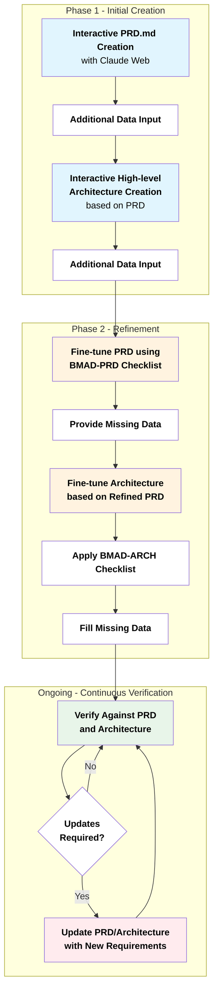

# Development Flow Diagram

## Overview

This diagram illustrates the phased approach for PRD and Architecture development with continuous verification.

## Flow Diagram

## Process Description

### **Phase 1 - Initial Creation**

- **Interactive PRD.md creation** with Claude Web (providing additional data)
- **Interactive high-level architecture creation** based on PRD with Claude Web (providing additional data)

### **Phase 2 - Refinement**

- **Fine-tune PRD** using BMAD-PRD checklist (providing missing data)
- **Fine-tune Architecture** based on refined PRD, and BMAD-ARCH checklist and filling missing data

### **Ongoing - Continuous Verification**

- **Continuously verify** against PRD and Architecture
- **Update PRD/Architecture** from things that pop up which require updates
