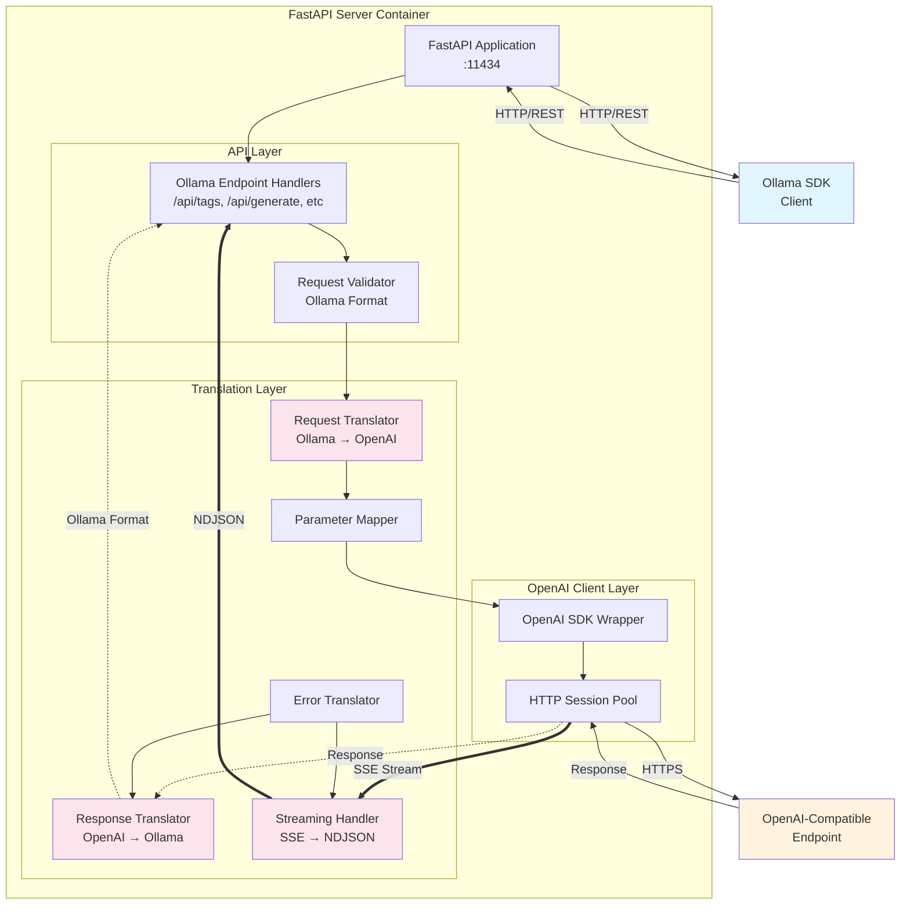

# Component Diagrams

```mermaid
graph TB
    subgraph "FastAPI Server Container"
        A[FastAPI Application<br/>:11434]
        
        subgraph "API Layer"
            B[Ollama Endpoint Handlers<br/>/api/tags, /api/generate, etc]
            C[Request Validator<br/>Ollama Format]
        end
        
        subgraph "Translation Layer"
            D[Request Translator<br/>Ollama → OpenAI]
            E[Response Translator<br/>OpenAI → Ollama]
            F[Parameter Mapper]
            G[Streaming Handler<br/>SSE → NDJSON]
            H[Error Translator]
        end
        
        subgraph "OpenAI Client Layer"
            I[OpenAI SDK Wrapper]
            J[HTTP Session Pool]
        end
        
        A --> B
        B --> C
        C --> D
        D --> F
        F --> I
        I --> J
        
        %% Non-streaming path
        J -.->|Response| E
        E -.->|Ollama Format| B
        
        %% Streaming path  
        J ==>|SSE Stream| G
        G ==>|NDJSON| B
        
        %% Error paths
        H --> E
        H --> G
    end
    
    K[Ollama SDK<br/>Client] -->|HTTP/REST| A
    A -->|HTTP/REST| K
    
    J -->|HTTPS| L[OpenAI-Compatible<br/>Endpoint]
    L -->|Response| J
    
    style K fill:#e1f5fe
    style L fill:#fff3e0
    style D fill:#fce4ec
    style E fill:#fce4ec
    style G fill:#fce4ec
```
