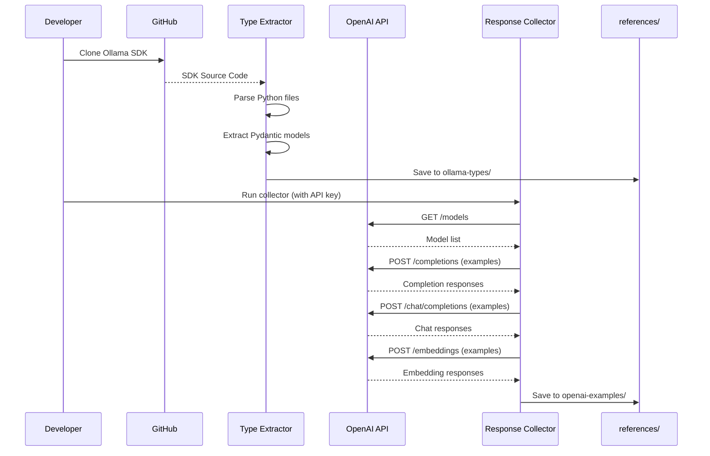
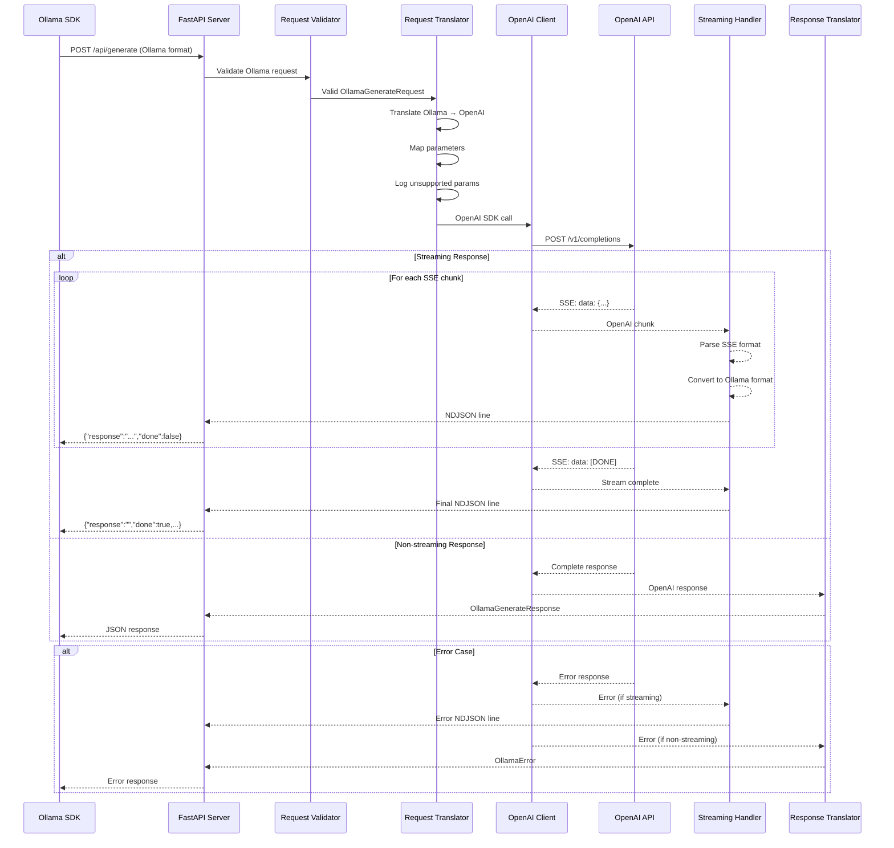
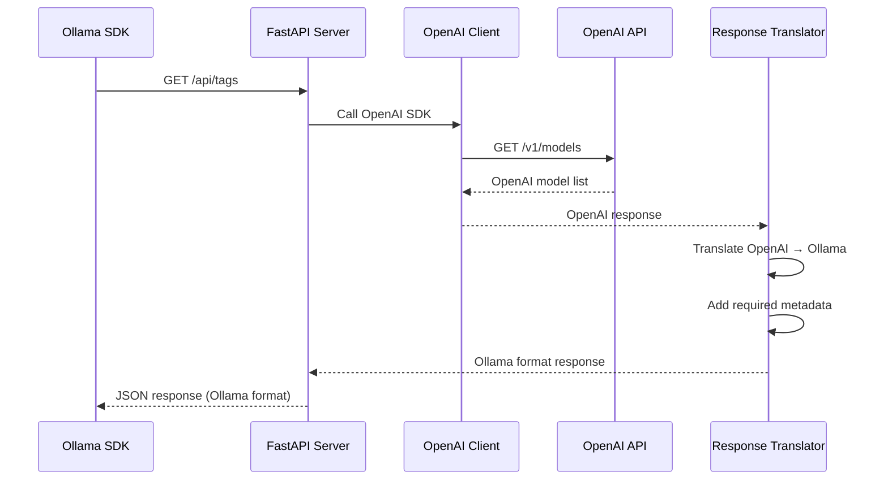

# Core Workflows

## Development Phase Workflow

```mermaid
sequenceDiagram
    participant Dev as Developer
    participant GH as GitHub
    participant Ext as Type Extractor
    participant OAI as OpenAI API
    participant Col as Response Collector
    participant Ref as references/
    
    Dev->>GH: Clone Ollama SDK
    GH-->>Ext: SDK Source Code
    Ext->>Ext: Parse Python files
    Ext->>Ext: Extract Pydantic models
    Ext->>Ref: Save to ollama-types/
    
    Dev->>Col: Run collector (with API key)
    Col->>OAI: GET /models
    OAI-->>Col: Model list
    Col->>OAI: POST /completions (examples)
    OAI-->>Col: Completion responses
    Col->>OAI: POST /chat/completions (examples)
    OAI-->>Col: Chat responses
    Col->>OAI: POST /embeddings (examples)
    OAI-->>Col: Embedding responses
    Col->>Ref: Save to openai-examples/
```

## Generate Text Workflow

```mermaid
sequenceDiagram
    participant SDK as Ollama SDK
    participant API as FastAPI Server
    participant Val as Request Validator
    participant Trans as Request Translator
    participant Client as OpenAI Client
    participant OpenAI as OpenAI API
    participant Stream as Streaming Handler
    participant RTrans as Response Translator
    
    SDK->>API: POST /api/generate (Ollama format)
    API->>Val: Validate Ollama request
    Val->>Trans: Valid OllamaGenerateRequest
    Trans->>Trans: Translate Ollama → OpenAI
    Trans->>Trans: Map parameters
    Trans->>Trans: Log unsupported params
    Trans->>Client: OpenAI SDK call
    Client->>OpenAI: POST /v1/completions
    
    alt Streaming Response
        loop For each SSE chunk
            OpenAI-->>Client: SSE: data: {...}
            Client-->>Stream: OpenAI chunk
            Stream-->>Stream: Parse SSE format
            Stream-->>Stream: Convert to Ollama format
            Stream-->>API: NDJSON line
            API-->>SDK: {"response":"...","done":false}
        end
        OpenAI-->>Client: SSE: data: [DONE]
        Client-->>Stream: Stream complete
        Stream-->>API: Final NDJSON line
        API-->>SDK: {"response":"","done":true,...}
    else Non-streaming Response
        OpenAI-->>Client: Complete response
        Client-->>RTrans: OpenAI response
        RTrans-->>API: OllamaGenerateResponse
        API-->>SDK: JSON response
    end
    
    alt Error Case
        OpenAI-->>Client: Error response
        Client-->>Stream: Error (if streaming)
        Stream-->>API: Error NDJSON line
        Client-->>RTrans: Error (if non-streaming)
        RTrans-->>API: OllamaError
        API-->>SDK: Error response
    end
```

## List Models Workflow

```mermaid
sequenceDiagram
    participant SDK as Ollama SDK
    participant API as FastAPI Server
    participant Client as OpenAI Client
    participant OpenAI as OpenAI API
    participant Trans as Response Translator
    
    SDK->>API: GET /api/tags
    API->>Client: Call OpenAI SDK
    Client->>OpenAI: GET /v1/models
    OpenAI-->>Client: OpenAI model list
    Client-->>Trans: OpenAI response
    Trans->>Trans: Translate OpenAI → Ollama
    Trans->>Trans: Add required metadata
    Trans-->>API: Ollama format response
    API-->>SDK: JSON response (Ollama format)
```
