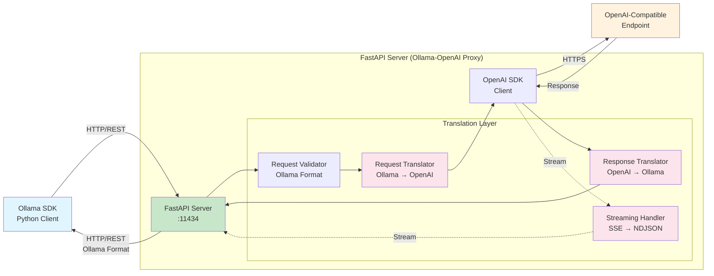
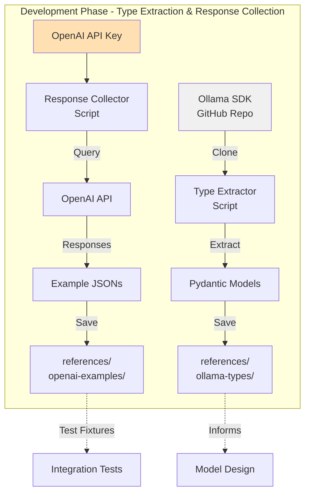

# High Level Architecture

## Technical Summary

The Ollama-OpenAI Proxy is a FastAPI server that acts as a translation layer between Ollama SDK clients and OpenAI-compatible endpoints. When an Ollama SDK makes HTTP/REST requests, the FastAPI server receives them in Ollama format, translates them to OpenAI format using the OpenAI SDK, forwards them to OpenAI-compatible endpoints, and then translates the responses back to Ollama format. The implementation follows a Test-Driven Development (TDD) approach, using Pydantic models extracted from the official Ollama SDK source code as the foundation for type safety and compatibility. The system uses Python 3.12 with async processing for efficient streaming support, containerized with Docker for easy deployment. Phase 1 requires an OpenAI API key to collect real response examples that serve as test fixtures, ensuring accurate translation between the two APIs. Core architectural patterns include SDK-based model extraction, real response collection, and strict type validation using Pydantic v2, all guided by KISS (Keep It Simple, Stupid) and YAGNI (You Aren't Gonna Need It) principles.

## High Level Overview

1. **Architectural Style**: Simple HTTP Proxy / API Gateway pattern
2. **Repository Structure**: Single repository (not applicable for monorepo/polyrepo as it's a single service)
3. **Service Architecture**: Monolithic proxy service with clear internal component separation
4. **Primary Data Flow**: 
   - Ollama SDK (HTTP/REST) → FastAPI Server → Translation Layer (Ollama→OpenAI) → OpenAI SDK → OpenAI-Compatible Endpoint
   - Response flow: OpenAI Endpoint → OpenAI SDK → Translation Layer (OpenAI→Ollama) → FastAPI Server → Ollama SDK
5. **Key Architectural Decisions**:
   - **SDK-Based Types**: Extract and use Ollama SDK's Pydantic models as source of truth
   - **TDD Methodology**: Write tests using Ollama SDK client before implementation
   - **Real Response Collection**: Capture actual OpenAI responses for accurate test fixtures
   - **Transparency First**: Act as invisible middleware between Ollama SDK and OpenAI
   - **Stateless Design**: No session management or request history
   - **Streaming Support**: Native async streaming for real-time responses
   - **Type Safety**: Pydantic v2 models for all request/response validation

## High Level Project Diagram

## Development Phase Diagram

## Architectural and Design Patterns

- **SDK Type Extraction Pattern:** Extract Pydantic models directly from Ollama SDK source - *Rationale:* Ensures 100% compatibility with SDK expectations
- **Test-Driven Development Pattern:** Write tests using Ollama SDK before implementation - *Rationale:* Guarantees compatibility and reduces rework
- **Response Collection Pattern:** Capture real OpenAI responses as test fixtures - *Rationale:* Ensures accurate translation based on actual API behavior
- **API Gateway Pattern:** Single entry point for all Ollama requests with protocol translation - *Rationale:* Provides clean interface and centralized request handling
- **Adapter Pattern:** Translation layer converts between Ollama and OpenAI formats - *Rationale:* Decouples format differences and enables independent evolution
- **Repository Pattern:** Abstraction for OpenAI client interactions - *Rationale:* Enables testing with mocks and potential future provider switching
- **Streaming Pattern:** Newline-delimited JSON (NDJSON) for real-time response streaming - *Rationale:* Matches Ollama SDK expectations for streaming responses
- **Error Mapping Pattern:** Standardized error translation between APIs - *Rationale:* Maintains compatibility with Ollama SDK error handling
