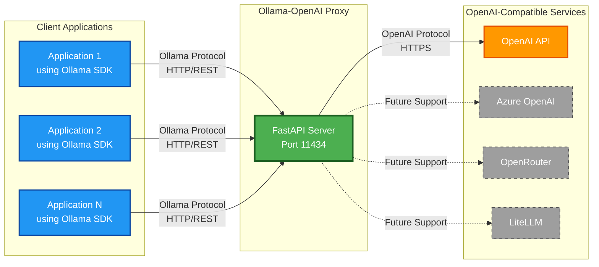
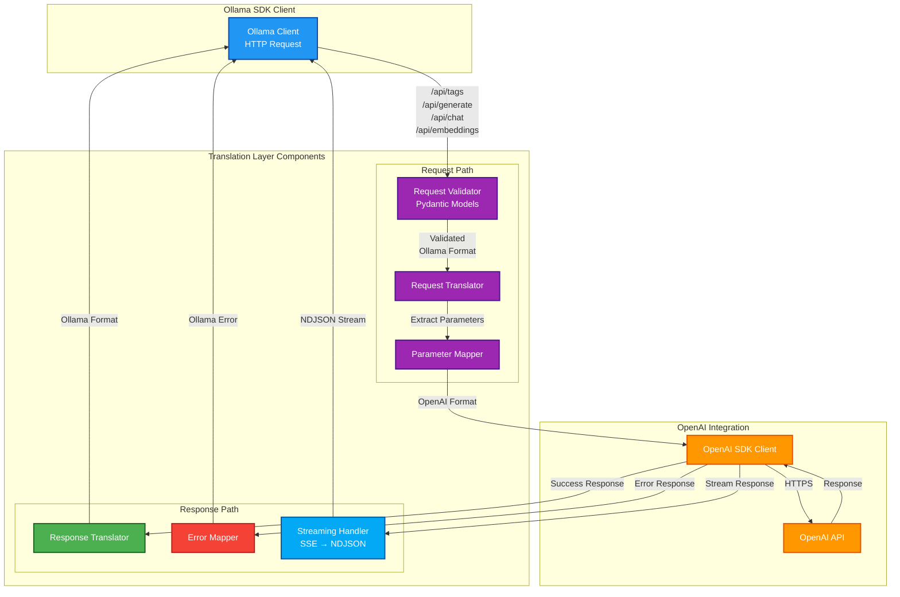

# Ollama-OpenAI Proxy Architecture Overview

## Project Goal Overview

This diagram illustrates the high-level goal of the Ollama-OpenAI Proxy - enabling applications using Ollama SDK to seamlessly connect to OpenAI-compatible services without code changes.



### Key Benefits:
- **Zero Code Changes**: Existing Ollama SDK applications work without modification
- **Drop-in Replacement**: Proxy runs on same port (11434) as Ollama
- **Protocol Translation**: Seamless conversion between Ollama and OpenAI formats
- **Future Extensibility**: Architecture supports multiple OpenAI-compatible providers

## Translation Layer Details

This diagram shows the internal translation layer and how requests/responses are transformed between Ollama and OpenAI protocols.



### Translation Examples:

#### 1. Model Listing (`/api/tags`)
- **Ollama Request**: `GET /api/tags`
- **OpenAI Request**: `GET /v1/models`
- **Translation**: 
  - OpenAI model IDs → Ollama model names
  - Add required Ollama metadata fields (size, digest, etc.)
  - Format as Ollama tags response

#### 2. Text Generation (`/api/generate`)
- **Ollama Request**: 
  ```json
  {
    "model": "llama2",
    "prompt": "Hello",
    "stream": true,
    "options": {
      "temperature": 0.7,
      "top_k": 40
    }
  }
  ```
- **OpenAI Request**:
  ```json
  {
    "model": "gpt-3.5-turbo-instruct",
    "prompt": "Hello",
    "stream": true,
    "temperature": 0.7,
    "max_tokens": null
  }
  ```
- **Translation**:
  - Map model names
  - Convert Ollama options to OpenAI parameters
  - Log warnings for unsupported parameters (top_k)
  - Transform SSE stream to NDJSON

#### 3. Chat Completion (`/api/chat`)
- **Ollama Format**: Messages with role-based history
- **OpenAI Format**: Chat completion with messages array
- **Translation**: Direct message format mapping with role preservation

#### 4. Embeddings (`/api/embeddings`)
- **Ollama Format**: Single or batch text input
- **OpenAI Format**: Input array with model specification
- **Translation**: Format response with Ollama's expected embedding structure

### Streaming Translation

The streaming handler performs real-time format conversion:

```
OpenAI SSE Format:          Ollama NDJSON Format:
data: {"choices":[{...}]}   {"model":"...","response":"...","done":false}
data: {"choices":[{...}]}   {"model":"...","response":"...","done":false}
data: [DONE]                {"model":"...","response":"","done":true,"context":[...]}
```

### Error Translation

All OpenAI errors are mapped to Ollama-compatible error responses:
- HTTP status codes preserved
- Error messages reformatted
- Ollama-specific error structure maintained